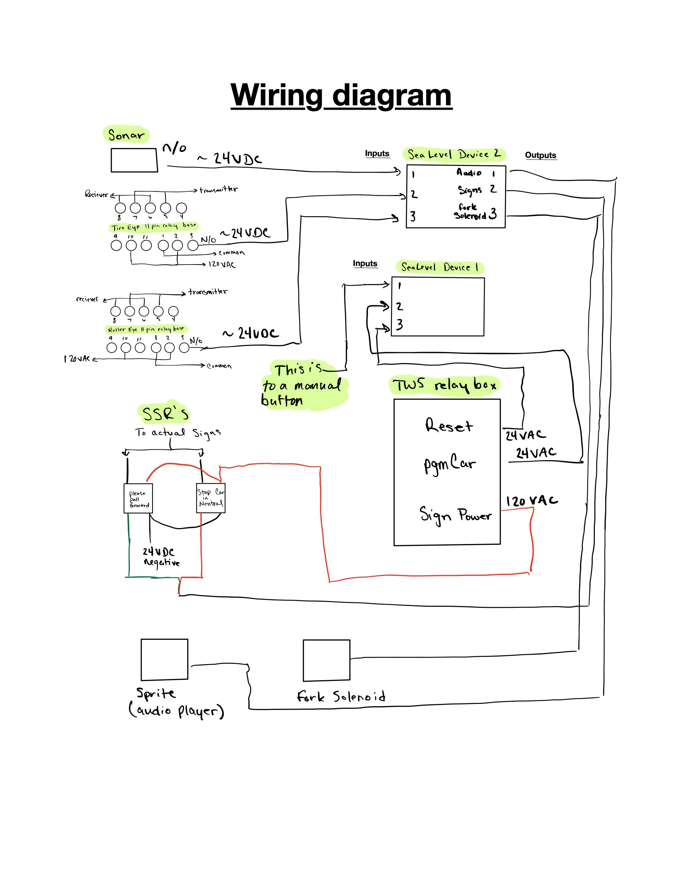
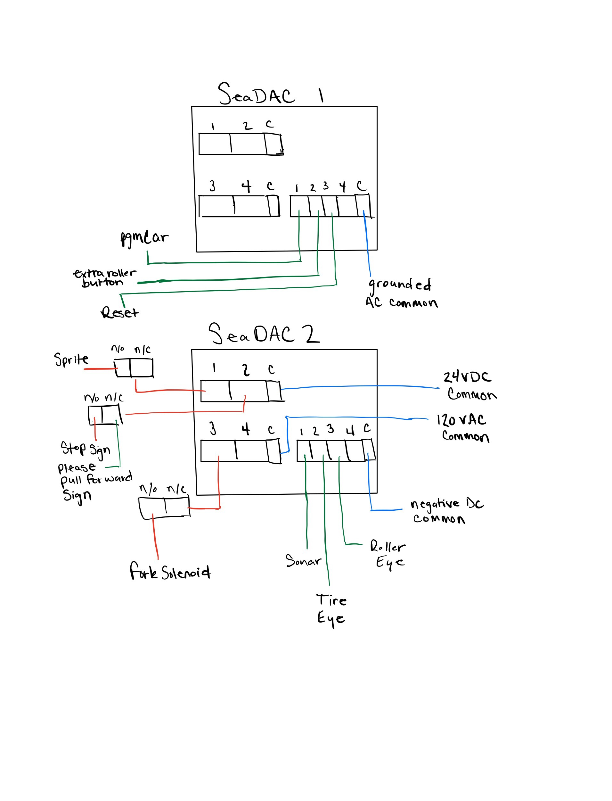

# WashEntrance

## Application Description 
This project uses PLC's to interface with with a TunnelWatch 5 relay box in order to automate vehicle loading into the car wash. 

### What the application accomplishes:
- Uses a sonar and a telco sensor to determine if the vehicle is in the proper loading position.
- Once the vehicle is in the proper position, audio will be played and the neon sign will change from "Please Pull Forward" to "Stop Car in Neutral". The sign and the audio are used as instructions to help the user determine they are in the proper position and what to do next. 
- Once the vehicle is in the proper position and the audio and signs have changed/played, a solenoid is activated to raise a fork, which will allow rollers to come up and move the vehicle through the car wash. 
- Another telco sensor is used to monitor the rollers. Two rollers are pushed up to move the car through the wash. The sensor is used to make sure the rollers are in safe positions, to prevent jams, and make sure no more or no less than two rollers are lifted. 
- The TunnelWatch 5 box then sends flags when the vehicle is moving and another vehicle can be loaded. The flags cancel the hold that prevents another vehicle from loading too close and reset the sign back to "Please Pull Forward".

### Parts List
- SeaLevel SeaDAC Lite model 8112 X 2
- Solid State Relays X 2 - The SSR's are used for the signs, 120VAC powers the signs and 24VDC is coming from the plc. The SSR's are switched on and off to alternate the signs and ramp up power. 
- Telco Sensors X 2
- Sonar
- Telco Sensor Amplifiers and 11 pin relay base X 2. 
- See wiring diagram to get full understanding of functionality. 

## Installation / Build Application 
1. Download zip file from GitHub. 
2. Open project in visual studio. 
3. NOTE - Make sure the log file location is correct in App.config and the variable "string iconPath" is the correct path to the .ico file in Form1.cs file < Form1_Load function
4. Right click on "WashEntrance_V1" and select "Publish" 
5. Click "Next" through prompts until a file dialog box appears to select installer download location. 

## Wiring Diagram 

